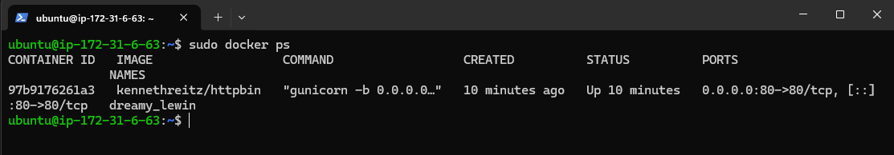

# Desafio Técnico: Analista de Suporte a Infraestrutura Junior - Sensedia
# Candidato: Flávio Zini.

## Objetivo

Este repositório contém a entrega do desafio técnico, demonstrando conhecimentos básicos em Containers, Versionamento com Git, Consumo de APIs REST e Documentação. A aplicação `httpbin` foi disponibilizada via Docker e seus endpoints foram validados.

## Processo Utilizado

1. Infraestrutura Cloud: Foi provisionada uma instância EC2 (Ubuntu) na AWS para hospedar a aplicação, com liberação de tráfego HTTP.

2. Containerização (Docker):Acesso à instância via SSH, instalação do serviço Docker e execução da imagem pública solicitada (`kennethreitz/httpbin`).

3\. Mapeamento de Rede: O container foi configurado para mapear a porta 80 do servidor para a porta 80 do container.

## Comando de Execução:

`sudo docker run -d -p 80:80 kennethreitz/httpbin`

# Evidência da Execução e Status do Container:

# Evidências de Testes (Consumo de APIs REST)

## Abaixo estão as capturas de tela/saídas dos comandos executados validando os endpoints da aplicação através do IP público da AWS.

1. Teste de Método GET (`/get`)

Comando: `curl http://18.229.163.17/get`

Evidência:

2. Teste de Método POST (`/post`)

Comando: `curl -X POST "http://18.229.163.17/post" -d "Vaga: Analista de Suporte..." -d "Candidato: Flavio Zini"`

Resultado: Os dados enviados no payload foram refletidos no bloco `form` da resposta.

Evidência:

3. Teste de Cabeçalhos e IP (`/headers` e `/ip`)

Evidência Headers:

Evidência IP:

