# Desafio Técnico: Analista de Suporte a Infraestrutura Junior - Sensedia
## Candidato: Flávio Zini

## Objetivo

Este repositório contém a entrega do desafio técnico, demonstrando conhecimentos básicos em Containers, Versionamento com Git, Consumo de APIs REST e Documentação. A aplicação `httpbin` foi disponibilizada via Docker e seus endpoints foram validados.

## Processo Utilizado

1\. Infraestrutura Cloud: Foi provisionada uma instância EC2 (Ubuntu) na AWS para hospedar a aplicação, com liberação de tráfego HTTP.

2\. Containerização (Docker):Acesso à instância via SSH, instalação do serviço Docker e execução da imagem pública solicitada (`kennethreitz/httpbin`).

3\. Mapeamento de Rede: O container foi configurado para mapear a porta 80 do servidor para a porta 80 do container.

## Etapa 1 - Criar a instância EC2 (Free Tier)

AWS EC2 Ubuntu 26.04:

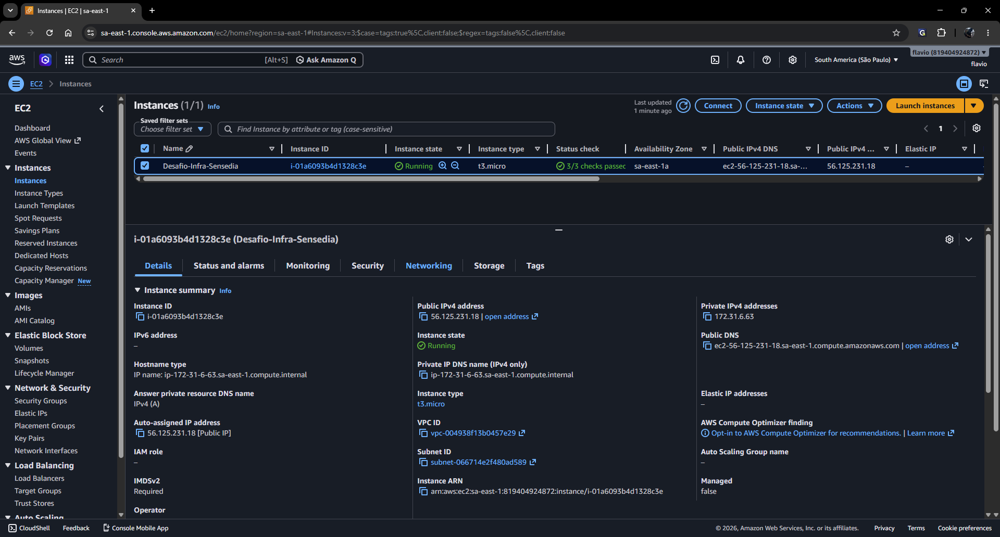

## Etapa 2 - Conexão via PowerShell

Acessar a instância via SSH

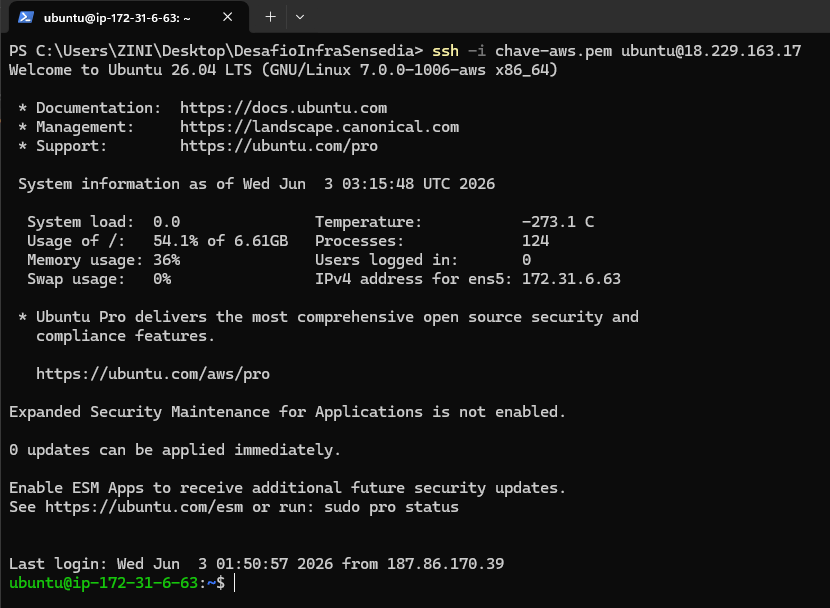

## Etapa 3 - Atualizar servidor

Comandos utilizados:

`sudo apt update`  
`sudo apt upgrade -y`  

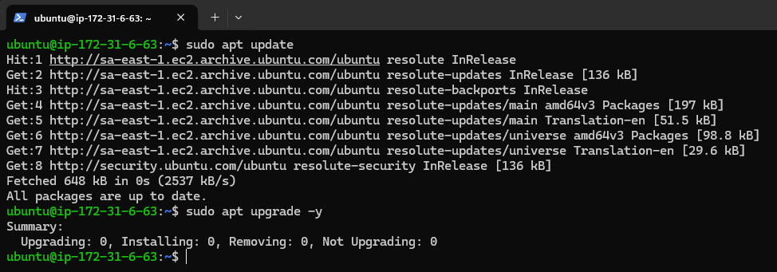

## Etapa 4 - Instalar Docker

Comandos utilizados:

`sudo apt install docker.io -y`  
`docker --version`  

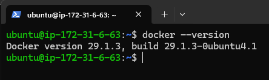

## Etapa 5 - Habilitar Docker

Comandos utilizados:

`sudo systemctl enable docker`  
`sudo systemctl start docker`  
`sudo systemctl status docker`  

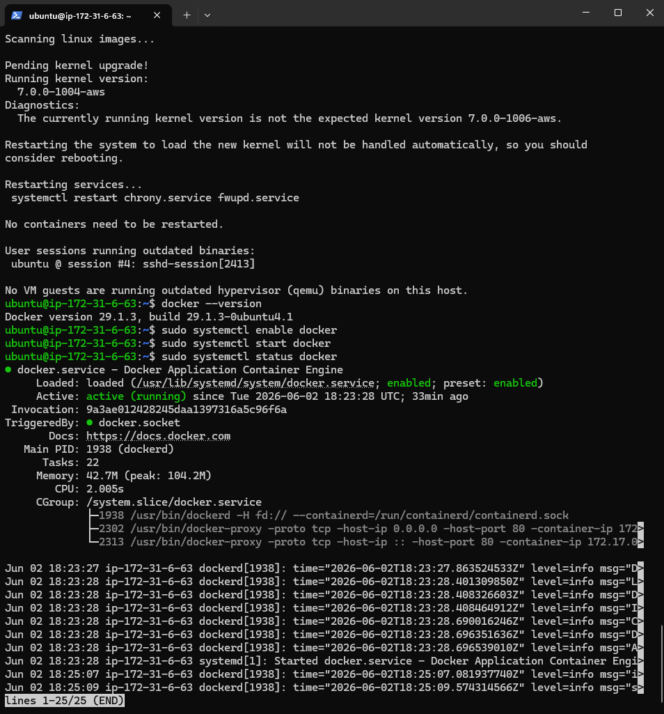

## Etapa 6 - Baixar a imagem

Comando utilizado:

`sudo docker pull kennethreitz/httpbin`

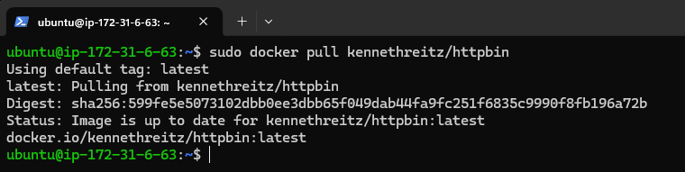

## Etapa 7 - Validar imagem

Comando utilizado:

`sudo docker images`

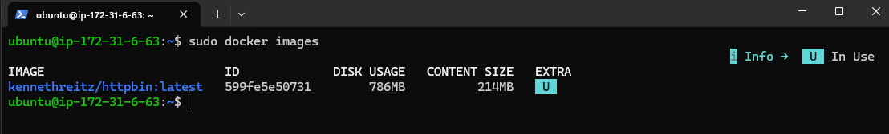

## Etapa 8 - Subir o Docker

Comando de Execução:

`sudo docker run -d -p 80:80 kennethreitz/httpbin`

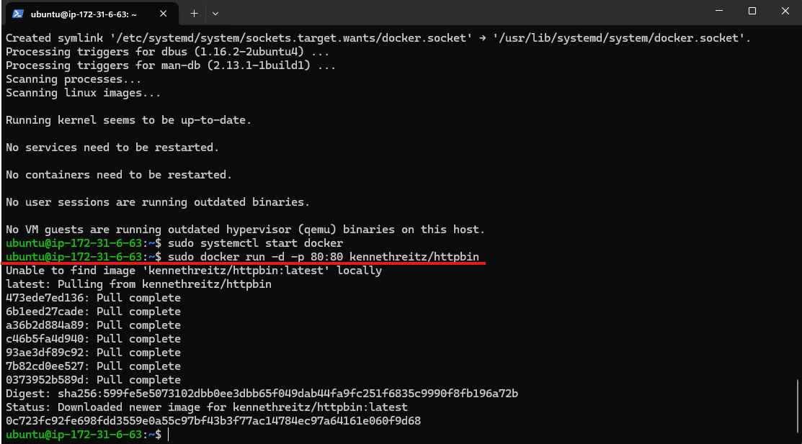

## Etapa 9 - Testar API (Consumo de APIs REST)

### Abaixo estão as capturas de tela/saídas dos comandos executados validando os endpoints da aplicação através do IP público da AWS.

#### 1\. Teste de Método GET (`/get`)

Comando utilizado:  

`curl http://18.229.163.17/get`

Evidência:

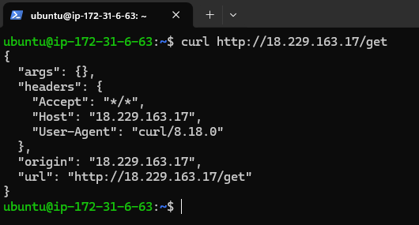

#### 2\. Teste de Método POST (`/post`)

Comando utilizado:  

`curl -X POST "http://18.229.163.17/post" -d "Vaga: Analista de Suporte..." -d "Candidato: Flavio Zini"`

#### Resultado: Os dados enviados no payload foram refletidos no bloco `form` da resposta.

Evidência:

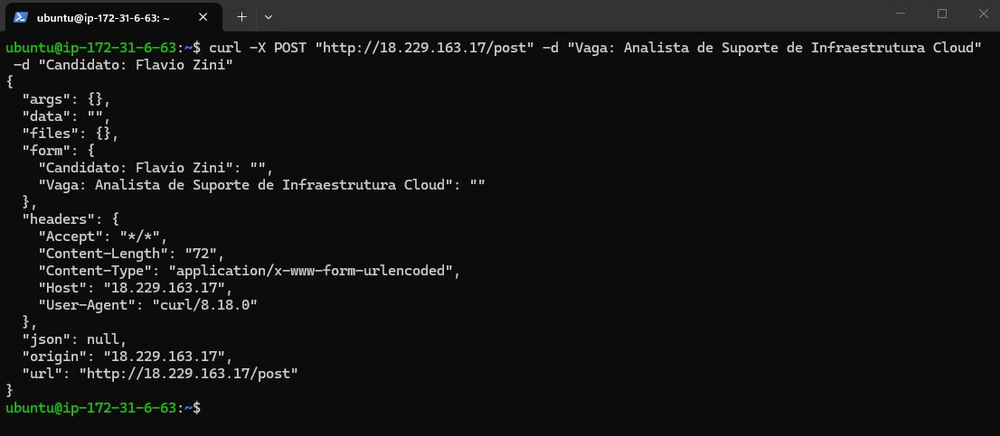

#### 3\. Teste de Cabeçalhos e IP (`/headers` e `/ip`)

Comandos utilizados:  

`curl http://18.229.163.17/headers`  
`curl http://18.229.163.17/ip`

Evidência Headers:

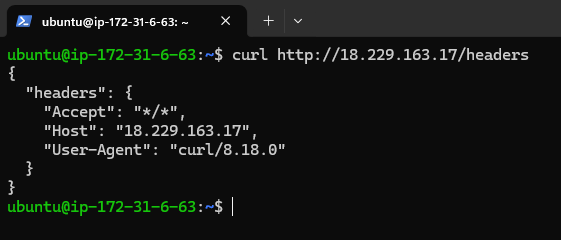

Evidência IP:

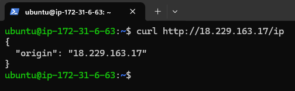

## Etapa 10 - Coleta de evidências extras

Comandos utilizado: 
 
`sudo docker logs httpbin`  
`sudo docker inspect httpbin`  
`sudo docker top httpbin`  

### Logs:

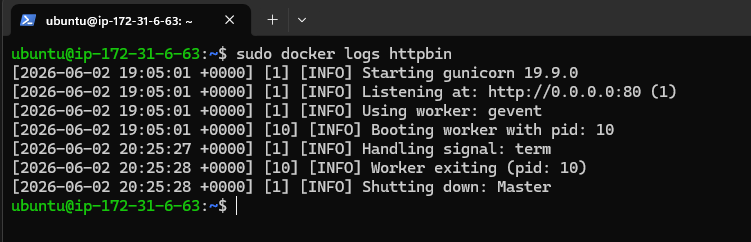

### Inspect:

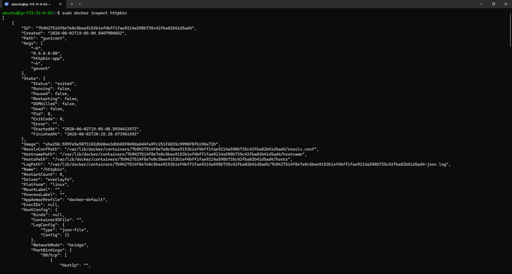

### Processos:

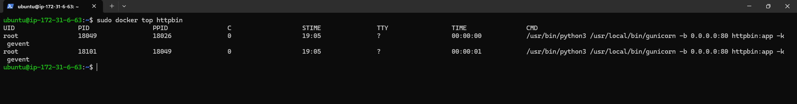

## 🏁 Considerações Finais

Este desafio foi uma ótima oportunidade para testar meus conhecimentos práticos com Docker, AWS e Git conectando a teoria que eu tinha com a prática exigida pela vaga. A necessidade de buscar entender como funciona cada passo antes de botar em prática reforçou ainda mais a minha motivação para integrar o time de Infraestrutura Cloud.

Agradeço à equipe pela oportunidade e pelo desafio proposto. Fico à total disposição para aprofundar qualquer asunto ou etapa deste processo durante uma futura conversa!
